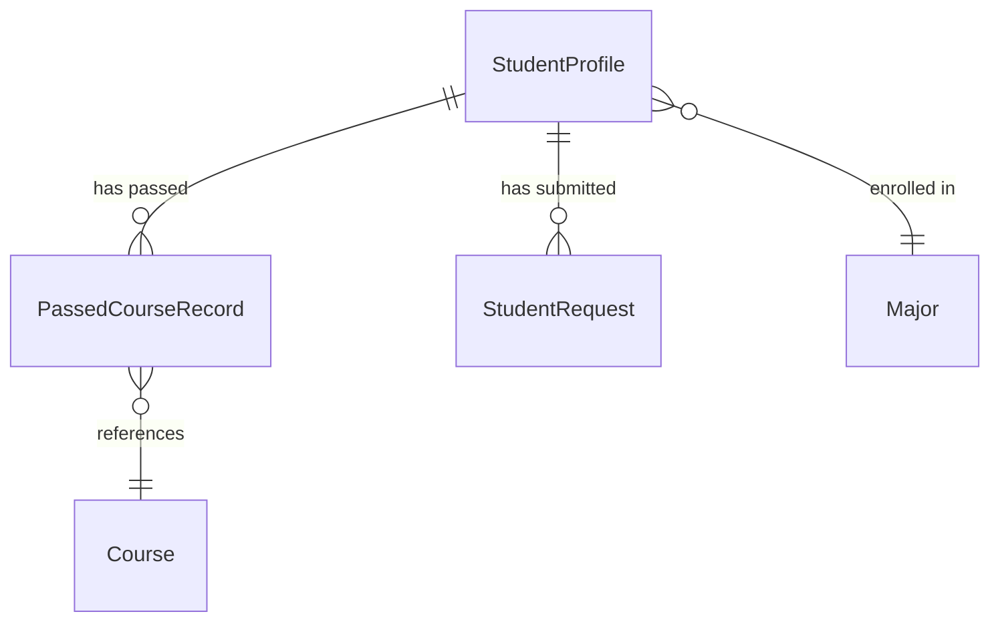

# Data Model: Student Profile

**Branch**: `001-student-profile` | **Date**: 2026-02-24

## Entities

### StudentProfile

The primary entity representing a student in the system.

| Field | Type | Required | Notes |
|-------|------|----------|-------|
| `nationalId` | `string` | ✅ | Unique identifier (primary key) |
| `universityId` | `string` | ✅ | System-generated, format: `YYYY-NNNN` (e.g., `2026-0001`). Admin can also enter manually. |
| `name` | `string` | ✅ | Student's full name |
| `major` | `Major` | ✅ | `'CS' \| 'IT' \| 'IS' \| 'General'` |
| `isTransfer` | `boolean` | ✅ | Default: `false` |
| `previousUniversity` | `string` | Only if transfer | Name of previous university |
| `isBlocked` | `boolean` | ✅ | Default: `false`. Blocked students have read-only access. |
| `passedCourses` | `PassedCourseRecord[]` | ✅ | Default: `[]`. Only populated at creation for transfer students. |
| `createdAt` | `string` | ✅ | ISO 8601 timestamp |
| `updatedAt` | `string` | ✅ | ISO 8601 timestamp |

**Computed fields** (not stored, derived at read time):
- `gpa`: Calculated from `passedCourses` grades and course credit hours
- `academicLevel`: Inferred from total passed credit hours
- `passedHours`: Sum of credit hours for non-failed courses

**Authentication**: University ID + National ID pair verification (no passwords stored).

### PassedCourseRecord

Links a student to a completed course with grade information.

| Field | Type | Required | Notes |
|-------|------|----------|-------|
| `courseCode` | `string` | ✅ | References existing `Course.code` |
| `grade` | `Grade` | ✅ | `'Excellent' \| 'Very Good' \| 'Good' \| 'Pass' \| 'Fail'` |
| `gradePoints` | `number` | ✅ | `4.0 \| 3.0 \| 2.0 \| 1.0 \| 0.0` |
| `isTransferred` | `boolean` | ✅ | `true` if from previous university |

### Grade (enum-like type)

```
'Excellent' → 4.0 points
'Very Good' → 3.0 points
'Good'      → 2.0 points
'Pass'      → 1.0 points
'Fail'      → 0.0 points
```

### StudentRequest (existing, extended relationship)

The existing `StudentRequest` type gains a new semantic relationship: the `studentId` field now maps to `StudentProfile.universityId`, linking requests to student profiles.

| Field | Type | Notes |
|-------|------|-------|
| `studentId` | `string` | Now semantically linked to `StudentProfile.universityId` |

**No schema changes** to the `StudentRequest` type — only a new query function `getRequestsByStudentId()`.

## Relationships



- **StudentProfile → PassedCourseRecord**: One-to-many. A student can have 0 to many passed courses.
- **StudentProfile → StudentRequest**: One-to-many. A student can have 0 to many requests across semesters. Linked via `universityId` ↔ `studentId`.
- **PassedCourseRecord → Course**: Many-to-one. Each record references an existing course by code.

## Validation Rules

1. `nationalId` must be unique across all student profiles
2. `universityId` must be unique across all student profiles
3. `name` must be non-empty
4. `major` must be one of: `CS`, `IT`, `IS`, `General`
5. `passedCourses[].courseCode` must reference a valid course in the course database
6. `passedCourses[].courseCode` must not be duplicated within the same student's list
7. If `isTransfer` is `true`, `previousUniversity` must be non-empty
8. If `isTransfer` is `false`, `previousUniversity` must be `undefined` and `passedCourses` must be `[]`
9. `universityId` must match format `YYYY-NNNN` (4-digit year, dash, 4-digit sequence)

## Storage Schema

```json
{
  "key": "student_profiles",
  "value": [
    {
      "nationalId": "29901011234567",
      "universityId": "2026-0001",
      "name": "Ahmed Mohamed",
      "major": "CS",
      "isTransfer": false,
      "isBlocked": false,
      "passedCourses": [],
      "createdAt": "2026-02-24T12:00:00Z",
      "updatedAt": "2026-02-24T12:00:00Z"
    },
    {
      "nationalId": "29801021234567",
      "universityId": "2026-0002",
      "name": "Fatma Ali",
      "major": "IT",
      "isTransfer": true,
      "isBlocked": false,
      "previousUniversity": "Cairo University",
      "passedCourses": [
        {
          "courseCode": "CS101",
          "grade": "Excellent",
          "gradePoints": 4.0,
          "isTransferred": true
        }
      ],
      "createdAt": "2026-02-24T12:30:00Z",
      "updatedAt": "2026-02-24T12:30:00Z"
    }
  ]
}
```

## University ID Generation

```typescript
function generateUniversityId(existingProfiles: StudentProfile[]): string {
    const year = new Date().getFullYear();
    const yearPrefix = `${year}-`;
    const existingIds = existingProfiles
        .map(p => p.universityId)
        .filter(id => id.startsWith(yearPrefix))
        .map(id => parseInt(id.split('-')[1], 10))
        .filter(n => !isNaN(n));
    const nextSeq = existingIds.length > 0 ? Math.max(...existingIds) + 1 : 1;
    return `${year}-${String(nextSeq).padStart(4, '0')}`;
}
```

## Conversion to Roadmap Engine

The existing `Student` type used by `roadmapLogic.ts`:

```typescript
interface Student {
    major: Major;
    gpa: number;
    passedCourses: string[];  // Course codes only
    passedHours: number;
}
```

**Mapping**: `toStudentForRoadmap(profile: StudentProfile) → Student`
- `major` → direct copy
- `gpa` → calculated from `passedCourses` grades
- `passedCourses` → extracted course codes (excluding failed)
- `passedHours` → sum of credit hours (excluding failed)
