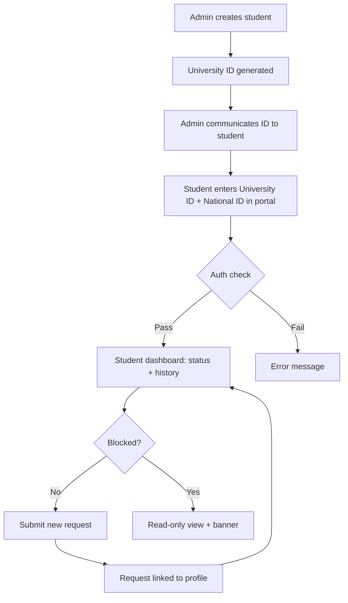

# Quickstart: Student Profile Feature

**Branch**: `001-student-profile` | **Date**: 2026-02-24

## Prerequisites

- Node.js 18+ installed
- `npm install` completed in project root

## Development Commands

```bash
# Start dev server
npm run dev
# → http://localhost:5173

# Type check
npx tsc --noEmit

# Build
npm run build
```

## Key File Locations

| What | Path |
|------|------|
| Student types & CRUD | `src/types/student.ts` |
| Request types & CRUD | `src/types/request.ts` |
| Grade utilities (GPA, level) | `src/lib/gradeUtils.ts` |
| Student state context | `src/context/StudentContext.tsx` |
| Student form (admin) | `src/components/StudentForm.tsx` |
| Student profile viewer | `src/components/StudentProfileView.tsx` |
| Admin dashboard | `src/pages/AdminDashboard.tsx` |
| Student portal | `src/pages/StudentPortal.tsx` |

## Feature Flow


